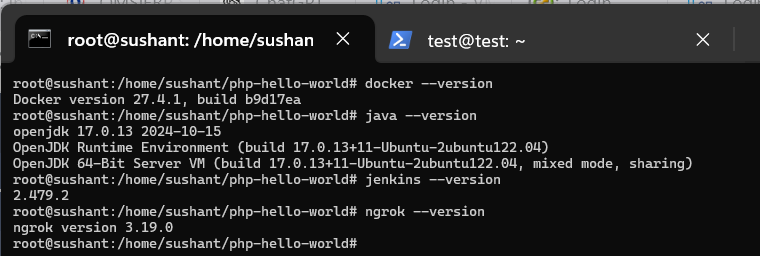
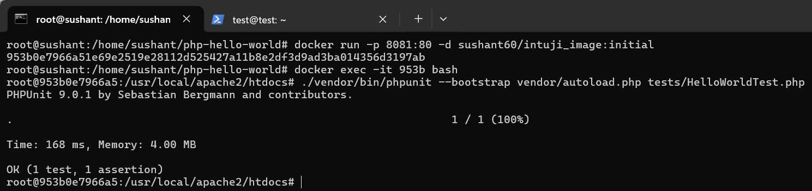
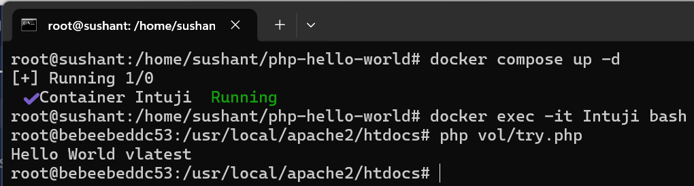
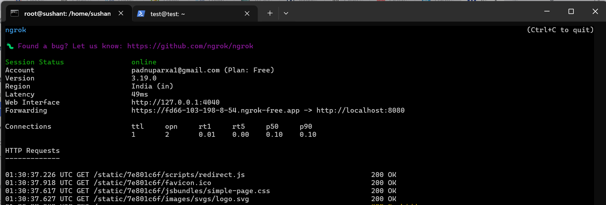
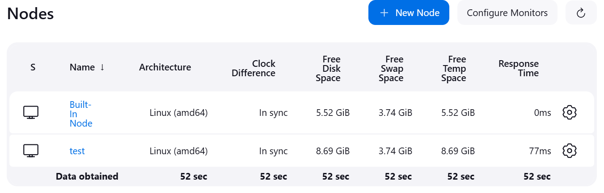
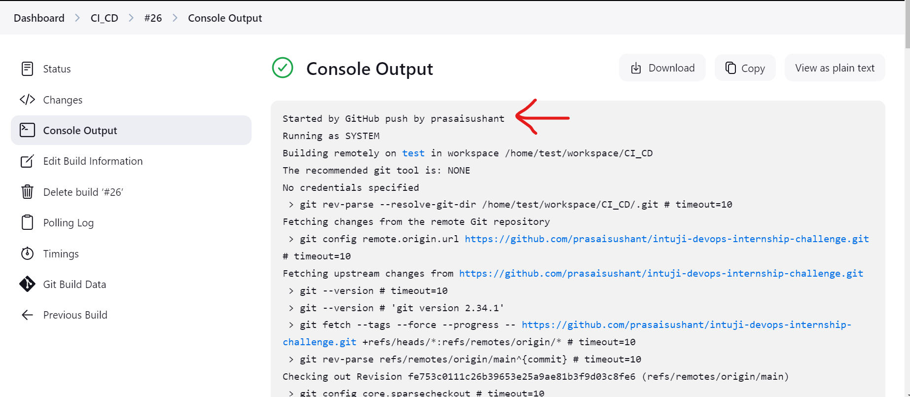
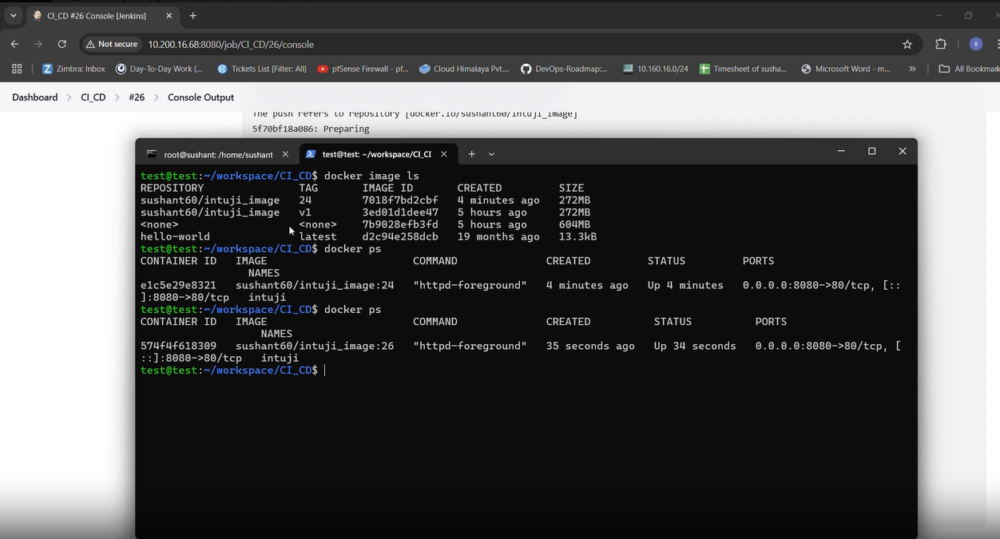

# DevOps Internship Challenge - README

## Overview

For this internship challenge, a virtual machine (VM) running **Ubuntu 22.04.5 LTS** was set up. A **bash script** (`docker_instal.sh`) was created to install **Docker**, but since the assignment also required **Jenkins**, which depends on **Java 17**, another bash script (`install_docker_java_jenkins_ngrok.sh`) was written to install **Docker**, **Java**, **Jenkins**, and **ngrok**. 

**Ngrok** was installed to facilitate the GitHub webhook, as the VM uses a private IP. Although **Webhook Relay** could be an alternative, it has limitations on the number of relays in the free account, so **ngrok** was preferred.

---

## Installation (TASK 1)

### 1. Make the Script Executable

The script was made executable using the following command:

```bash
chmod +x ./install_docker_java_jenkins_ngrok.sh
```

### 2. Run the  Script 

The script was executed using the following command:

```bash
./install_docker_java_jenkins_ngrok.sh
```

### 3. Installation Verification

The installation of Docker, Java, Jenkins, and ngrok was verified.

  
*Image showing installation status verification.*

## (TASK 2)
### 1. Clone the Provided Repository

The repository provided (`https://github.com/silarhi/php-hello-world.git`) was cloned with the following command:

```bash
git clone https://github.com/silarhi/php-hello-world.git
```

### 2. Move the Scripts into the Repository

The previously created installation scripts were moved into the cloned repository:

```bash
mv docker_instal.sh install_docker_java_jenkins_ngrok.sh php-hello-world/
```

### 3. Create a Dockerfile

A **Dockerfile** was created to define the steps for building the Docker image:

```bash
nano Dockerfile
```

The Dockerfile used a **multi-stage build** to minimize the image size and speed up subsequent builds:

- The first stage (builder) used a **PHP-based image** to download dependencies via **Composer**.
- The final build stage used the official **Apache image**.

The image was built using the following command:

```bash
docker build -t sushant60/intuji_image:initial .
```

### 4. Run the Container

A container was created from the built image:

```bash
docker run -p 8081:80 -d sushant60/intuji_image:initial
```

To enter the running container:

```bash
docker exec -it <container_id> bash
```

### 5. Test the Image

Once inside the container, the following command was used to run the test:

```bash
./vendor/bin/phpunit --bootstrap vendor/autoload.php tests/HelloWorldTest.php
```

  
*Image showing the PHPUnit test execution inside the Docker container.*

### 6. Push Image to Docker Hub

The image was pushed to **Docker Hub** under the repository `intuji_image`:

```bash
docker push sushant60/intuji_image:initial
```

Docker Hub URL: [https://hub.docker.com/r/sushant60/intuji_image](https://hub.docker.com/r/sushant60/intuji_image)

## TASK 3 Docker Compose

### Create a Volume and Test File

A volume directory was created, and a test file (`try.php`) was added. Then, a **docker-compose.yml** file was created, which defined the image, container name, volume, and a bridge-type network.

The container was started using:

```bash
docker-compose up
```

The container was run in detached mode using:

```bash
docker-compose up -d
```

Inside the container, the PHP file was executed:

```bash
php vol/try.php
```

  
*Image showing PHP file execution inside the container.*

Additionally, I have a separate repository with a Docker Compose setup that emulates a **Jenkins Master** server and two **Jenkins Agent** nodes (Ansible and Docker servers). You can check it out here: [Jenkins with Docker Compose Example](https://github.com/prasaisushant/Jenkins_ansible_docker_compose.git)

In these images, all necessary packages and containers are configured to rejoin the Jenkins setup, even if the container is deleted and recreated.

---

## TASK 4: Jenkins CI/CD Setup

### 1. Create a New Jenkins VM

A new VM running **Ubuntu 22.04.5 LTS** was created to serve as a **Jenkins agent** and deploy Docker containers. The `docker_instal.sh` bash script was used to install **Docker** on this VM.

### 2. Check Jenkins Service Status

To check if Jenkins was running, the following command was executed:

```bash
systemctl status jenkins
```

Jenkins can be accessed from the dashboard at:

```
http://10.200.16.68:8080/
```

Meanwhile, **ngrok** was used to forward traffic:

```bash
ngrok http 8080
```

  
*Image showing ngrok forwarding traffic to the Jenkins server.*

This provides a public URL for the GitHub webhook.

### 3. Configure Jenkins

In Jenkins, the necessary plugins were installed, and a user was created. To add the newly created VM as a Jenkins node, the following steps were taken:

- Navigate to **Manage Jenkins → Nodes**.
- Add the new VM as a node using the **Launch agent by connecting it to the controller** method.

The command was provided to launch the agent on the new VM, which successfully connected the Jenkins agent.

  
*Image showing the Jenkins agent node configuration.*

### 4. GitHub Repository Setup

A new GitHub repository named **intuji-devops-internship-challenge** was created. The local repository's remote URL was updated, and the repository was pushed to GitHub.

### 5. GitHub Webhook Configuration

In the **GitHub repository**'s webhook settings, the **ngrok** URL was used as the payload URL, followed by `/github-webhook/`:

```
https://fd66-103-198-8-54.ngrok-free.app/github-webhook/
```

### 6. Create a Jenkins Job

In Jenkins, a new **Freestyle Project** was created, named **CI_CD**. The following configuration was set:

- **GitHub Project**: The GitHub repository URL was provided.
- **Source Code Management**: Git was selected, the repository URL was provided, and the branch was set to **main**.
- **Build Triggers**: The **GitHub hook trigger for GITScm polling** was selected.

### 7. Build Step Configuration

In the build step, Execute Shell was chosen. A new bash script (cd.sh) was added to the GitHub repository. This script builds a new image, removes the previous container, runs the new container, and pushes the image to Docker Hub. While a Pipeline item type would be more appropriate for CI/CD using Jenkins, the task explicitly mentioned using the Freestyle item type, so a bash script was used instead. Since the number of executors on the built-in node is set to 0, all tasks will run on the agent node. Moreover, since there is only one agent node where the container is being deployed, we can proceed with this setup.

The following code was added in Jenkins' **Execute Shell** section:

```bash
DOCKER_IMAGE="sushant60/intuji_image"
BUILD_TAG=${BUILD_NUMBER}  # so that each new image gets a new tag

chmod +x cd.sh
sudo ./cd.sh $DOCKER_IMAGE $BUILD_TAG
```

### 8. Jenkins Job Execution

Whenever changes are made to the GitHub repository, Jenkins will:

- Clone the repository into the `/workspace/CI_CD` directory of the agent.
- Trigger the `cd.sh` script to create a new image and deploy it.

---
  
*Image showing the Jenkins job detail*

  
*Image showing the Image change*

## Conclusion

This setup successfully implements **CI/CD** using **Jenkins**, **Docker**, and **GitHub webhooks**, allowing for automatic deployment of new changes to the Docker container. The use of **ngrok** ensures the webhook can reach the private VM's Jenkins server without needing to expose it directly to the internet.


